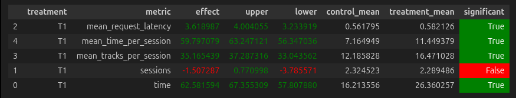

## Homework 2 Report

### Abstract

В данной работе реализована рекомендательная система на основе взвешенной суммы предсказаний моделей BERT4Rec, SASRec и Co-occurrences для генерации item-to-item рекомендаций музыкальных треков. Для увеличения разнообразия предсказаний дополнительно используется MMR diversity reranking.

Для формирования обучающих последовательностей используется правило отбора взаимодействий на основе статистик распределения времени прослушивания. 
В решении также дополнен стандартный I2I recommender. Обновлённая версия выбирает якорные треки на основе недавнего поведения пользователя и взвешивая их с учётом давности и времени прослушивания, чтобы лучше отразить текущий интерес в сессии. Затем он ранжирует кандидатов среди похожих треков, одновременно штрафуя артистов, которых пользователь уже часто слушал, чтобы уменьшить повторяемость.

### Детали

Данные представляют собой взаимодействия пользователь–трек с величиной `time ∈ [0,1]`, отражающей долю прослушивания трека. Для выделения значимых взаимодействий используется статистическое правило:
$
[
time \ge \mu + \frac{\sigma}{2}
]
$

где:

* $(\mu)$ — среднее значение `time` по датасету
* $(\sigma)$ — стандартное отклонение

Такой порог позволяет учитывать разброс значений и выделять взаимодействия выше среднего уровня вовлеченности без чрезмерной жесткости фильтрации.

После фильтрации формируются пользовательские последовательности фиксированной длины, используемые для обучения последовательных моделей BERT4Rec и SASRec, которые моделируют зависимости между элементами во времени. В обучении нейросетевых моделей дополнительно используются признаки треков (например, исполнитель и жанр).

Co-occurrence строится по локальным окнам пользовательских историй: для каждого трека считаются соседние треки в пределах COOC_CONTEXT_WINDOW позиций среди последних COOC_SESSION_TAIL взаимодействий пользователя. Частота совместной встречаемости пары нормализуется на популярность обоих треков как cooc_count / sqrt(pop_i * pop_j), что снижает влияние глобально популярных треков. Для каждого трека сохраняются топ-MAX_COOC_NEIGHBORS_PER_ITEM наиболее близких соседей.

Для объединения моделей применяется per-user min-max нормализация, приводящая скоры каждой модели к диапазону [0,1] и обеспечивающая сопоставимость их вкладов в ансамбле. Объединение предсказаний разных подходов реализовано со следующими весами. Это не оптимальное значение, но оно уже дало хороший результат.

```python
SOURCE_WEIGHTS = {
    'bert4rec': 0.60,
    'cooc': 0.15,
    'sasrec': 0.60,
}
```

Полученные в результате объединения кандидаты дополнительно ранжируются с помощью MMR. Он позволяет балансировать релевантность и разнообразие.
Код для подготовки рекомендаций представлен в notebook'e: jupyter/hw2-final.ipynb

Также был переделан recommender. Треки выбираются и ранжируются с учётом сессионных сигналов: времени прослушивания (listened_time), давности (RECENCY_DECAY) и порога значимых взаимодействий (MIN_GOOD_TIME), с дополнительным бустом для текущего трека. Для топ-MAX_ANCHORS якорей извлекаются кандидаты из I2I-индекса (I2I_LOOKAHEAD) и скорируются по позиции в списке похожих объектов с учётом штрафа за повторяемость артистов (ARTIST_REPEAT_DISCOUNT). Такой подход позволяет учитывать краткосрочные предпочтения пользователя и одновременно контролировать разнообразие рекомендаций.

Результаты A/B теста на 20 000 смоделированных пользователей: 


